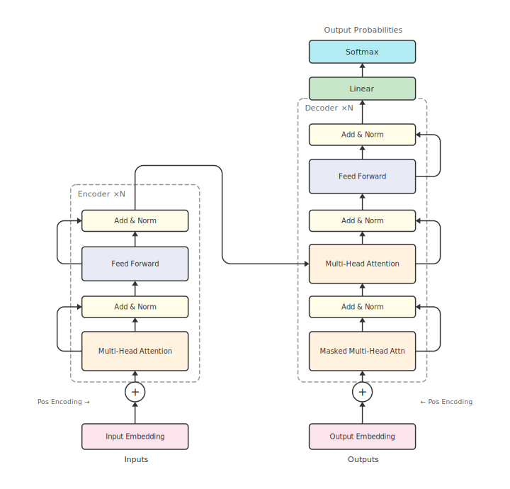
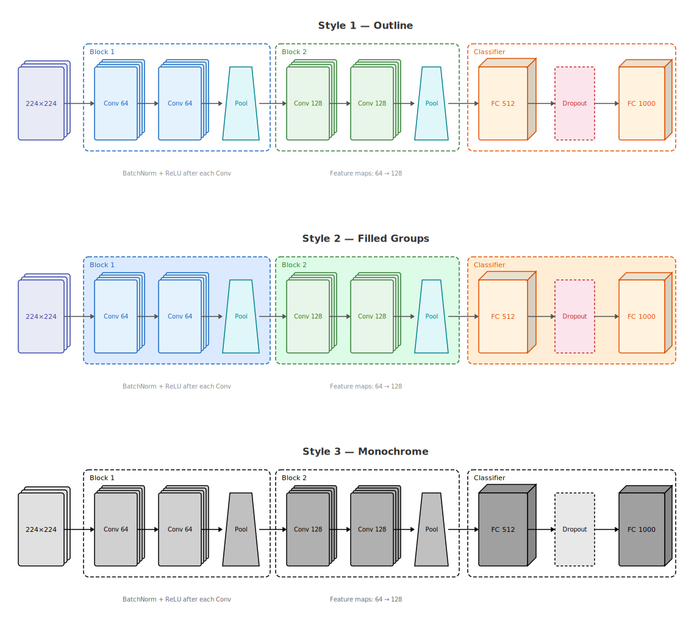

# Figcraft

Code-driven SVG diagram library for TypeScript / Node.js.

Write a few lines of TypeScript, get publication-ready architecture diagrams — SVG, PNG, JPG, WebP, PDF.

[](https://www.npmjs.com/package/figcraft)
[](./LICENSE)

**Website:** [figcraft.xflowing.com](https://figcraft.xflowing.com/)

<p align="center">
  
</p>

<p align="center">
  
</p>

## Features

- **10 element types** — rect, circle, diamond, trapezoid, text, image, cylinder, cuboid, sphere, stack
- **11 arrow heads** — triangle, stealth, vee, circle, diamond, bar, dot, and their open variants
- **Smart layout** — `row()`, `col()`, `grid()`, `group()` with auto-alignment
- **Markdown labels** — `**bold**`, `*italic*`, `` `code` ``, `$math$` in any element
- **Multi-format export** — SVG, PNG, JPG, WebP, PDF with `fit` auto-crop
- **MCP integration** — AI agents generate diagrams via natural language
- **Zero browser dependency** — runs entirely in Node.js

## Install

```bash
npm install figcraft
```

Requires Node.js 18+.

## Quick Start

Create `diagram.ts`:

```typescript
import { Figure } from 'figcraft'

const fig = new Figure(800, 400, { bg: '#fff' })

const a = fig.rect('Input', {
  pos: [50, 100], size: [120, 50],
  fill: '#e3f2fd', radius: 6
})

const b = fig.rect('Output', {
  pos: [250, 100], size: [120, 50],
  fill: '#c8e6c9', radius: 6
})

fig.arrow(a, b, { head: 'stealth', label: 'data' })

await fig.export('diagram.svg', { fit: true, margin: 20 })
```

Run:

```bash
npx tsx diagram.ts
```

## Elements

| Type | Method | Description |
|------|--------|-------------|
| Rect | `fig.rect()` | Rounded rectangle |
| Circle | `fig.circle()` | Circle |
| Diamond | `fig.diamond()` | Decision diamond |
| Trapezoid | `fig.trapezoid()` | Trapezoid (pooling layers) |
| Text | `fig.text()` | Text label with Markdown |
| Image | `fig.image()` | Embedded image |
| Cylinder | `fig.cylinder()` | 3D cylinder (databases) |
| Cuboid | `fig.cuboid()` | 3D cuboid (tensors) |
| Sphere | `fig.sphere()` | 3D sphere |
| Stack | `fig.stack()` | Multi-layer stack |

## Arrows

```typescript
// Basic
fig.arrow(a, b)
fig.arrow(a, b, { head: 'stealth', color: '#1565c0' })

// Anchors
fig.arrow(a, b, { from: 'right', to: 'left' })
fig.arrow(a, b, {
  from: { side: 'bottom', at: 30 },
  to: { side: 'top', at: 70 }
})

// Paths
fig.arrow(a, b, { path: 'curve', curve: 40 })
fig.arrow(a, b, { path: 'polyline', cornerRadius: 8 })

// Styles
fig.arrow(a, b, { style: 'dashed', bidirectional: true })

// Fan-out / Fan-in
fig.arrows(source, [t1, t2, t3], { head: 'stealth' })

// Fork (shared trunk)
fig.fork(source, [t1, t2, t3], { head: 'stealth' })
```

## Layout

```typescript
fig.row([a, b, c], { gap: 40 })           // Horizontal
fig.col([a, b, c], { gap: 30 })           // Vertical
fig.grid([a, b, c, d, e, f], { cols: 3 }) // Grid
fig.group([a, b, c], { label: 'Pipeline' }) // Group box
```

## Export

```typescript
await fig.export('out.svg')                          // SVG
await fig.export('out.png', { fit: true, scale: 3 }) // High-res PNG
await fig.export('out.jpg', { quality: 95 })         // JPG
await fig.export('out.webp')                         // WebP
await fig.export('out.pdf')                          // PDF

const svg = fig.render({ fit: true })                // SVG string
```

## MCP Integration

Add to your Claude Code or Cursor MCP config:

```json
{
  "mcpServers": {
    "figcraft": {
      "command": "npx",
      "args": ["figcraft-mcp"]
    }
  }
}
```

Then describe diagrams in natural language — the AI agent handles the rest.

## Documentation

Full docs: [figcraft.xflowing.com](https://figcraft.xflowing.com/)

## License

[MIT](./LICENSE) — by [XFlow](https://xflowing.com/)
